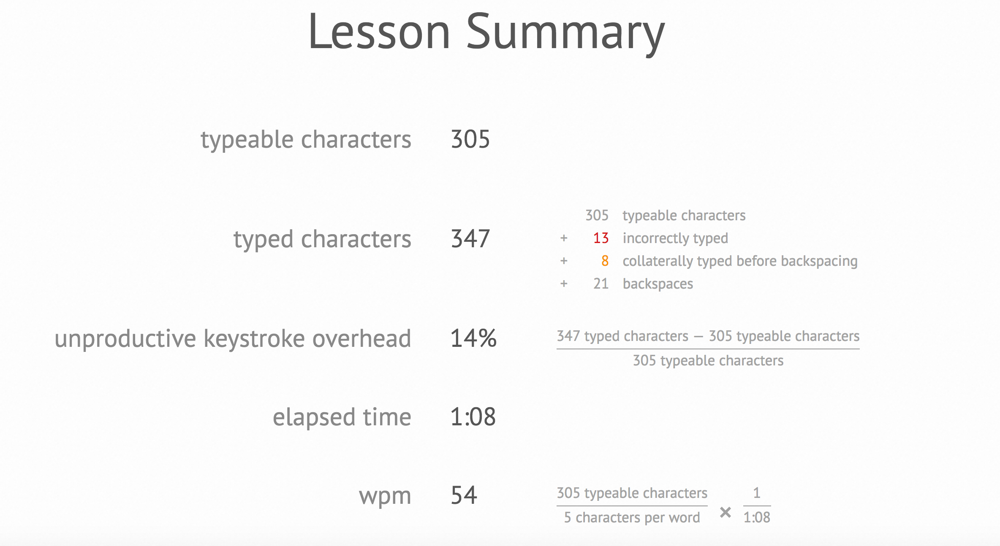

## TO-DOs
- [ ] collect the errors for statistics and report them after the game (try to get as close as possible to image above)
- [ ] persist the errors to disk (SQLite?) so we can do monthly reports
- [ ] fix display error with consecutive two newlines
- [ ] fix highlight issue with the "function" keyword
- [ ] auto indent
- [ ] add some *real* code to type, instead of the same old source file. perhaps randomize which file gets selected when the game is run?
- [ ] ignore lines that are just comments
